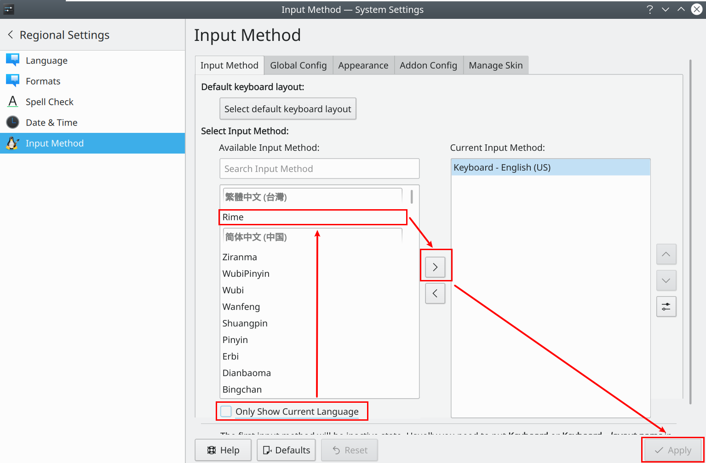

## 注意点

### 编辑系统配置文件

编辑系统配置文件要用 sudoedit 或 sudo -e，如：

```bash
EDITOR=vim sudoedit path_to_file
```

而编辑 sudoers 文件，则必须要使用：

```bash
sudo EDITOR=vim visudo
```

### 千万不要把U盘文件移除到垃圾桶

如果不小心做了，移除U盘时文件在垃圾桶将无法清空！！！

解决方法：重新插入U盘打开进入，用鼠标右键垃圾桶图标清空既可。

### Vnote 安装时间巨长！可试着安装 vnote-git
## 磁盘挂载
查看挂载情况：
```
lsblk -l
```
查看配置挂载文件：
```
cat /etc/fstab
```
## ffmpeg

### 转换编码格式

H.264：

```bash
ffmpeg -i [input.file] -c:v libx264 output.mp4
```

H.265：

```bash
ffmpeg -i [input.file] -c:v libx265 output.mp4
```

### 更改为720×1820(高×宽)

```bash
ffmpeg -i output-h264.mp4 -vf scale=1280:720 output-h264-720.mp4 
```

## 切换tty2

+ 进入：`Ctrl + Alt + F2`

+ 退出：`Ctrl + Alt + F1`或`Alt + F1`

## powerlevel10k配置

```bash
p10k configure
```
## 刷新DNS缓存

## 命令

### chattr 更改文件属性

更改文件属性，如

```shell
chattr +i /path/to/file
# i - immutable(不可变的): Cannot be modified, deleted... Can only be set by root.
# 移除
chattr -i /path/to/file
```

### 查看系统信息

```
neofetch
```

### top

功能：监听进程运行状态

交互操作：
P：按照 CPU 的使用率排序，默认就是此选项；
N：按照 PID 排序；
M：按照内存的使用率排序；
k：按照 PID 给予某个进程一个信号。一般用于中止某个进程，信号 9 是强制中止的信号；

## kde 桌面快捷键

### 窗口
+ 窗口最大化和还原 `win+PgUp`
+ 窗口最小化 `win+PgDn`

### 打开搜索框
```
alt+f2
```

## pacman

### 应用程序搜索

```bash
yay -Ss nerd-font
或
pacman -Ss nerd-font
```

### 卸载

卸载依赖以及配置

```bash
sudo pacman -R -sn torbrowser-launcher
或
sudo pacman -Rsn torbrowser-launcher 
```

## yay

**快速安装**`sudo pacman -S yay`

### 下载

准备

```bash
# 注：分开执行！
sudo pacman -S base-devel
sudo pacman -S git
```

下载

```bash
cd /opt
sudo git clone https://aur.archlinux.org/yay.git
```

更改用户

```bash
sudo chown -R yourname:users ./yay
```

编译安装

```bash
cd yay
makepkg -si
# 注：如果下载失败再试一下 
```

### 升级 AUR 包 (试用)

```bash
yay -Sua <packagename>
```

### 查看配置

```bash
yay -P -g
```

## konsole

+ show munubar: Ctrl + Shit + M

## archlinux 基础安装笔记

+ [重要链接]([archlinux 基础安装 | archlinux 简明指南 — Arch Linux 安装使用教程](https://arch.icekylin.online/rookie/basic-install.html#_7-1-%E5%88%86%E5%8C%BA))

+ [全新安装](https://arch.icekylin.online/rookie/basic-install-detail.html#%F0%9F%86%95-%E5%85%A8%E6%96%B0%E5%AE%89%E8%A3%85)这一步在[7. 分区和格式化(使用 Btrfs 文件系统)](https://arch.icekylin.online/rookie/basic-install.html#_7-%E5%88%86%E5%8C%BA%E5%92%8C%E6%A0%BC%E5%BC%8F%E5%8C%96-%E4%BD%BF%E7%94%A8-btrfs-%E6%96%87%E4%BB%B6%E7%B3%BB%E7%BB%9F) 步骤之前 ！

+ sda2、sda3分区在双系统配置中为C盘和D盘(不用理会)，([archlinux 基础安装 | archlinux 简明指南 — Arch Linux 安装使用教程](https://arch.icekylin.online/rookie/basic-install.html#_7-1-%E5%88%86%E5%8C%BA))

+ 要记得看图片！

+ 为了创建子卷，我们需要先将 `Btrfs` 分区挂载到 `/mnt` 下：
  
  ```shell
  mount -t btrfs -o compress=zstd /dev/sdxn /mnt 注：sdxn-->sda5
  ```

+ 通过如下命令使用 `pacstrap` 脚本安装其它必要的功能性软件：
  
  ```shell
  pacstrap /mnt dhcpcd iwd vim sudo zsh zsh-completions
  改为 pacstrap /mnt dhcpcd iwd vim sudo zsh-completions
  ```

+ 17.安装引导程序
  
  需要安装引导程序，os-prober不需要安装 —— 为了能够引导 win10

+ swap分区：5G

+ sdx: `x` 为字母 `a`、`b` 或 `c` 等等

+ sdxn: `n`为1、2、3等等

+ 不能多次执行 genfstab，应该编辑 fstab 修正错误。

+ 分区：格式化 -> 挂载 -> 配置fstab 文件

+ [linux进行硬盘分区挂载](https://cloud.tencent.com/developer/article/1183198?from=15425)

+ [磁盘空间清理](https://arch.icekylin.online/advanced/system-ctl.html#%E7%A3%81%E7%9B%98%E7%A9%BA%E9%97%B4%E6%B8%85%E7%90%86)

## 中文输入法

### fcitx或 **fcitx5(建议)**：

+ 安装 **fcitx** 或 **fcitx5(建议)**：
  
  ```bsah
  [admin@arch ~]$ sudo pacman -S fcitx-im
  或 
  [admin@arch ~]$ sudo pacman -S fcitx5-im
  ```

+ 输入下面的指令安装 fcitx 的 GUI 配置工具(先不用安装)：
  
  ```bash
  [admin@arch ~]$ sudo pacman -S kcm-fcitx
  或
  [admin@arch ~]$ sudo pacman -S kcm-fcitx5 
  ```

+ 安装 rime 的输入法：
  
  ```bash
  [admin@arch ~]$ sudo pacman -S fcitx-rime
  或
  [admin@arch ~]$ sudo pacman -S fcitx5-rime 
  ```
+ 安装词库
```bash
sudo pacman -S fcitx5-pinyin-zhwiki-rime fcitx5-pinyin-moegirl-rime。
```
+ 导入词库
参考：https://wiki.archlinux.org/title/Fcitx5_(%E7%AE%80%E4%BD%93%E4%B8%AD%E6%96%87)#%E5%AF%BC%E5%85%A5%E8%AF%8D%E5%BA%93
+ sudoedit 编辑 /etc/environment，加上如下内容：
  
  最好参考官网，[Fcitx5 (简体中文) - ArchWiki](https://wiki.archlinux.org/title/Fcitx5_(%E7%AE%80%E4%BD%93%E4%B8%AD%E6%96%87)#%E5%AE%89%E8%A3%85)
  
  ```
  GTK_IM_MODULE=fcitx
  QT_IM_MODULE=fcitx
  XMODIFIERS=@im=fcitx
  INPUT_METHOD=fcitx
  SDL_IM_MODULE=fcitx  //为了让 SDL2 库的游戏，比如 Dota2 能正常使用
  ```

+ 重启系统
  
 ```bash
 systemctl reboot
 ```

+ 添加 rime 输入法
  「 开始菜单 」 > 「 System Settings 」 > 「 Personalization 」 一栏下面的 「 Regional Settings 」 > 「 Input Method 」，取消勾选 「Only Show Current Language」 > 「 Rime 」 > 「 > 」 > 「 Apply 」 应用生效。
  
  

+ 移除默认的 Keyboard - English (US)

### ibus安装（不推荐-不好用）

+ 安装软件包：
  
  ```bash
  sudo pacman -S ibus ibus-rime
  yay -S ibus-qt
  ```

+ 添加 rime 输入法
  
  ```bash
  ibus-setup
  ```
  
  启动后选择 "Input Methods"（输入法），点击 "Add"（添加），输入 chinese ，选择 rime，移除其他输入法

+ 编辑/添加配置文件`~/.xprofile`
  
  ```
  export GTK_IM_MODULE=ibus
  export XMODIFIERS=@im=ibus
  export QT_IM_MODULE=ibus
  ibus-daemon -d -x
  ```

### 输入法字典下载后没有显示

需要在`default.custom.yaml`添加该输入法

### 横排和竖排的修改

在`ibus_rime.custom.yaml`修改(添加一下)  注：只针对 ibus-rime有效

### Rime 配置目录

fcitx-rime 的大部分的配置文件在 `~/.config/fcitx/rime` 下，如果是 ibus 版本，将对应的 fcitx 替换成 ibus 即是配置地址，如果是fcitx5，则在 `~/.local/share/fcitx5/rime`

### 显示输入拼音

在 Input Method -> Configure addons -> Rime，关闭 "Show preedit within application"

### 更改字体大小

修改`~/.config/fcitx5/conf/classicui.conf`

```
# 按屏幕 DPI 使用
PerScreenDPI=False

# Font (设置成你喜欢的字体)
Font="Sans 14"
```

### 输入法诊断

```bash
fcitx5-diagnose
```

### Rime 默认英文输出配置

```
patch:
  switches:
    - name: ascii_mode
      reset: 1 # 1为默认英文，0为默认中文 
      states: [中文, 西文]
```

### 有些字母无法输出如“/”

按空格键即可，要选择其他字符，再按“/”键自身即可选择

### 获取到的程序名称
```bash
 dbus-send --print-reply=literal --dest=org.fcitx.Fcitx5 /controller org.fcitx.Fcitx.Controller1.DebugInfo
```

## Python

### pip安装

```bash
sudo pacman -S python-pip
```

为当前用户安装包

```bash
pip install --user SomePackage
```

### 创建虚拟环境

```bash
python3 -m venv <DIR>
source <DIR>/bin/activate
```

退出

```bash
deactivate
```

## tor

```bash
sudo pacman install torbrowser-launcher
```

## 启动模式

调整启动方式已经为 `UEFI `

## ventoy

退出：F5:Tools ->Power->reboot

## 代理

> 注意：安装代理软件前不要使用国内的镜像源！！！

### Qv2ray

代理推荐 Qv2ray

如果无法下载，在`/etc/pacman.conf` 添加清华源，更新一下软件缓存  

```conf
## OpenTUNA (China CDN) (ipv4, https)
[archlinuxcn]
Server = https://opentuna.cn/archlinuxcn/$arch
```

### 终端代理

```bash
注：使用本机IP地址 
export https_proxy=http://127.0.0.1:xxxx
export http_proxy=http://127.0.0.1:xxxx
或
export all_proxy=http://127.0.0.1:xxxx
```

## Go

### 配置文件路径

`~/.config/go/env `

### 查看配置

```bash
go env
```

## 镜像源

### 添加

```bash
sudoedit vim /etc/pacman.d/mirrorlist   #在文件的最顶端添加

sudoedit vim /etc/pacman.conf   #在文件末尾添加，这是第三方的
```

### 更新软件源缓存

> 注意：archlinux不支持部分升级，也就是不支持单独更新升级某一个软件。不可以使用 `pacman -Sy package`，也不可以使用`pacman -Sy`或`pacman -Syy`，要升级只能一起升级。

每次修改镜像之后都应该使用以下命令刷新：
```bash
pacman -Syyu
```

### 更新系统

```bash
pacman -Syu
```
### 升级与更新

- 避免部分升级。不要运行 `pacman -Sy <软件包名称>`。此命令在安装软件包时部分升级你的系统。相反，优先使用 `pacman -Syu` 来更新系统，然后使用 `package -S <软件包名称>` 安装软件包。
- 避免使用 `pacman -Syu -force` 命令。`-force` 将忽略程序包和文件冲突，并且可能会以破损的程序包或损坏的系统结束。
- 不要使用 `pacman -Rdd <软件包名称>`。此命令在删除软件包时不会执行依赖性检查。

### 软件包降级

```
downgrade <package>
```

### 列出已安装的包

```bash
pacman -Qe
```

### 查看包的信息

```bash
pacman -Qi packagename
```
### 找出孤立包
```
pacman -Qdt
```
## 问题

### error: failed to commit transaction (invalid or corrupted package (PGP signature))

安装 `archlinuxcn-keyring` 以包导入 GPG key。

```bash
sudo pacman -S archlinuxcn-keyring
```

### curl: (7) Failed to connect to git.io port 443 after 21028 ms: Connection refused

终端配置代理

### error: libinih: key "xxx" is unknown
按照要求删除签名无效的包缓存。
如果还不行就使用如下命令清理全部包缓存：
```
sudo pacman -Sc
```
### node: error while loading shared libraries: libicui18n.so.70: cannot open shared object file: No such file or directory

版本问题，安装使用比较新的`nodejs`版本即可。

### Discover无法使用

安装依赖

```bash
sudo pacman -S packagekit-qt5
```

### Discover无法启动

打开`System Monitor`，选择`Processes`，找到`plasma-discover`，`End Process`即可

### VM虚拟机共享目录无法显示

[见链接](https://askubuntu.com/questions/29284/how-do-i-mount-shared-folders-in-ubuntu-using-vmware-tools)

### 中文乱码

+ 将`en_US.UTF-8`和`zh_CN.UTF-8`的注释从配置文件`/etc/locale.gen`去掉
  
  ```
  # /etc/locale.gen
  en_US.UTF-8 UTF-8
  zh_CN.UTF-8 UTF-8
  ```

+ 然后执行
  
  ```bash
  sudo locale-gen
  ```

+ 安装字体
  
  ```bash
  sudo pacman -S adobe-source-han-serif-cn-fonts
  ```

### Word排版错乱

```bash
# 为单个用户安装字体
# 在~/.local/share/fonts/下新建目录：win_fonts
mkdir ~/.local/share/fonts/win_fonts
# 将Windows系统Fonts目录里的所有文件全部复制到Ubuntu系统，注意我的挂载点：/media/david/OS，你的电脑不会是该目录，注意自己查询。
cp /media/david/OS/Windows/Fonts/*.* ~/.local/share/fonts/win_fonts
# 删除.fon文件
rm -f ~/.local/share/fonts/win_fonts/*.fon
```

生成字体的索引信息

> 要在字体目录里面执行命令

```bash
mkfontscale
mkfontdir
```

更新字体缓存：

```bash
fc-cache -fv
```

参考文章：

[解决WPS 排版错乱的个人经验－统信UOS官方论坛](https://bbs.chinauos.com/zh/post/11617)

[Linux系统使用Windows系统字体的方法_知行合一2018的博客-CSDN博客_linux使用字体](https://blog.csdn.net/davidhopper/article/details/78898881)

### WPS字体糢糊

[WPS Office (简体中文) - ArchWiki](https://wiki.archlinux.org/title/WPS_Office_(%E7%AE%80%E4%BD%93%E4%B8%AD%E6%96%87)#KDE%E4%B8%8Bdpi%E4%B8%8D%E5%AF%B9%E7%A7%B0%E5%AF%BC%E8%87%B4%E7%9A%84%E5%AD%97%E4%BD%93%E6%A8%A1%E7%B3%8A)

[具体教程](http://www.hmmnx.com/archives/archmanjaro-jie-jue-wps-zi-ti-mo-hu-wen-ti)

### 中文有异体字形

调整字体优先级：
在~/.fonts.conf添加，前提是安装有这种字体

```
<?xml version="1.0"?>
<!DOCTYPE fontconfig SYSTEM "fonts.dtd">
<fontconfig>
  <alias>
    <family>sans-serif</family>
    <prefer>
      <family>Source Han Serif CN</family>
    </prefer>
  </alias>
  <alias>
    <family>monospace</family>
    <prefer>
      <family>Source Han Serif CN</family>
    </prefer>
  </alias>
</fontconfig>
```
更新字体缓存
```bash
fc-cache -fv
```
检查优先级
```bash
fc-match -s
```

### 开机启动时头像无法显示

在 sddm 配置中添加以下几行：[SDDM (简体中文) - ArchWiki](https://wiki.archlinux.org/title/SDDM_(%E7%AE%80%E4%BD%93%E4%B8%AD%E6%96%87)#%E7%94%A8%E6%88%B7%E5%A4%B4%E5%83%8F%E6%9C%AA%E6%98%BE%E7%A4%BA%E5%9C%A8_greeter_%E4%B8%8A)

```
/etc/sddm.conf.d/avatars.conf

[Theme]
EnableAvatars=true # enable avatars
DisableAvatarsThreshold=7 # set the threshold for the number of users. Avatars are not shown if this threshold is exceeded.
```

### 系统时间不正确

```
timedatectl set-ntp true # 将系统时间与网络时间进行同步
```

### vim复制内容到外面

选好文字，按`“+y`，复制到系统剪切板（注意+前的”不要漏了）

### Qv2ray无法更新订阅

把`Subscription Type `改为`Builtin Subscription Support:Basic Base64`即可

### vim 底部状态显示不正常

注消掉设置窗口大小参数，如：

```vim
"set lines=42 columns=150
```

### zsh 在终端 Home 键和 End 键无法使用

在`~/.zshrc`文件加入：

```
# key bindings
bindkey "\e[1~" beginning-of-line
bindkey "\e[4~" end-of-line
bindkey "\e[5~" beginning-of-history
bindkey "\e[6~" end-of-history
bindkey "\e[3~" delete-char
bindkey "\e[2~" quoted-insert
bindkey "\e[5C" forward-word
bindkey "\eOc" emacs-forward-word
bindkey "\e[5D" backward-word
bindkey "\eOd" emacs-backward-word
bindkey "\ee[C" forward-word
bindkey "\ee[D" backward-word
bindkey "^H" backward-delete-word
# for rxvt
bindkey "\e[8~" end-of-line
bindkey "\e[7~" beginning-of-line
# for non RH/Debian xterm, can't hurt for RH/DEbian xterm
bindkey "\eOH" beginning-of-line
bindkey "\eOF" end-of-line
# for freebsd console
bindkey "\e[H" beginning-of-line
bindkey "\e[F" end-of-line
# completion in the middle of a line
bindkey '^i' expand-or-complete-prefix 
```

### npm run scriptname 时提示“Permission denied”

删除 `node_modules` 文件夹，运行 `npm install` 重新安装依赖。

### npm 安装全局包权限问题

如果包不常用，可通过 `npx` 命令临时安装解决，如：

```bash
npx hexo Blog
```
或者更改全局安装路径：
参考：[Resolving EACCES permissions errors when installing packages globally](https://docs.npmjs.com/resolving-eacces-permissions-errors-when-installing-packages-globally)
### VS Code首次安装打开提示错误

错误信息：Writing login information to the keychain failed with error'GDBus.Error:org.freedesktop.DBus.Error.ServiceUnknown:

```bash
sudo pacman -S gnome-keyring
```

### VS Code每次打开弹出“Unlock Keyring”窗口(没用)

sudoedit 编辑`/etc/pam.d/sddm`文件，去掉其中三行参数前面的“-”号，如：

```
auth        include        system-login
auth        optional    pam_gnome_keyring.so  <=这行
-auth   optional  pam_kwallet5.so

account        include        system-login

password    include        system-login
password    optional    pam_gnome_keyring.so use_authtok  <=这行

session        optional    pam_keyinit.so force revoke
session        include        system-login
session        optional    pam_gnome_keyring.so auto_start  <=还有这行
-session  optional  pam_kwallet5.so auto_start
```

参考[GNOME Keyring - openSUSE Wiki](https://en.opensuse.org/GNOME_Keyring)
>以上问题安装1.5版本就可解决！
### 无法通过USB访问手机

将用户添加到`uucp`组

```bash
sudo gpasswd -a gan uucp
```

> 额外：如果用户已登录，必须重新登录使更改生效。

### 压缩包乱码

安装 Unarchiver：

```bash
sudo pacman -S unarchiver
```

解压压缩包：

```bash
unar xxx.zip
```
### 主题无法删除
在 `~/.local/share/plasma/desktoptheme/`这里找到相关主题删除即可。

## 杀掉应用

找到应用：

```
ps ax | grep 进程名
```

杀掉应用：

```
kill 进程ID
```

或者强制杀掉：
```
kill -KILL 进程ID
```

## Lvim

### 插件不起效
删除该插件和其配置，`LvimReload`更新配置，再用`PackerSync`完全删除插件。

## 其他

`EDITOR=vim visudo`：使用vim作为visudo文本编辑器

固体/机械硬盘判断：[链接](https://www.linuxprobe.com/linux-ssd-hdd.html)

官方安装教程：[链接](https://wiki.archlinux.org/title/Installation_guide_(%E7%AE%80%E4%BD%93%E4%B8%AD%E6%96%87)#Fstab)
