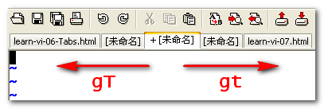

## 模式

+ 模式间的切换方法
  
  

+ 进入编辑模式
  
  - `i`：符号前插入
  - `I`：行首插入
  - `a`：符号后插入
  - `A`：行末进入插入模式
  - `o`：在下一行进入插入模式
  - `O`：在上一行进入插入模式
  - `s` 删除光标所在处的字符然后插入
  - `S` 删除光标所在行，在当前行的行首开始插入
  - `cw` ：删除从光标处开始到该单词结束的所有字符，然后插入
  - `C`：从光标到行末都会被换掉，然后插入

## 命令模式

+ 常用命令
  
  |        命令 | 作用                                                         |
  | ----------: | :----------------------------------------------------------- |
  |           d | 剪切选定块到缓冲区——先进入v模式(按v键)                       |
  |          dd | 删除（剪切）光标所在整行                                     |
  |        df+0 | 删掉 （`d for delete`）从光标到 0 (`f0`) 的内容              |
  |           x | 删除光标处的字符                                             |
  |    ZZ(大写) | 退出Vim；如果文件被修改，则先保存文件再退出                  |
  |    ZQ(大写) | 强制退出Vim，不保存任何修改                                  |
  |         5dd | 删除（剪切）从光标处开始的5行                                |
  |          dw | 删除一个单词。可在 dw 之前加一个数字n，表示删除 n 个指定的单词 |
  |          cc | 剪切所在行，进入编辑模式                                     |
  |         cnc | 剪切所在行到向下第n行                                        |
  |           y | 使用v模式(按v键)选定(使用相关按键)某一块的时候，复制选定块到缓冲区 |
  |          yy | 复制光标所在整行                                             |
  |         5yy | 复制从光标处开始的5行                                        |
  |           n | 显示搜索命令定位到的下一个字符串                             |
  | N (shift+n) | 显示搜索命令定位到的上一个字符串                             |
  |           u | 撤销上一步的操作                                             |
  |    Ctrl + r | 回退                                                         |
  |           p | 将之前删除（dd）或复制（yy）过的数据粘贴到光标后面(在光标位置之后粘贴) |
  |   Shift + p | 在光标位置之前粘贴                                           |
  |        nk/j | 往上跳n行/往下跳n行                                          |
  |           v | 进入VISUAL（可视）模式，可从光标开始移动选择多行             |
  |          gv | 重选上一次由可视模式所选择的文本范围                         |
  |          == | 当前行自动缩进对齐 (又称自动格式化)                          |
  |        gg=G | 当前文件所有行自动缩进对齐                                   |
  |          ra | 修改当前光标所在字符为a                                      |
  |           R | 一路替换下去                                                 |
  |      ci(xxx | 换掉括号里参数  ，要修改其他换掉`(`即可                      |
  |          gg | 跳转到当前文件的第一行                                       |
  |           G | 跳转光标到当前文件的最后一行                                 |
  |           ^ | 跳转到句首(不是第一列)                                       |
  |         w/W | 移光标至下一词                                               |
  |         b/B | 移光标至上一词                                               |
  |         e/E | 移光标至词末                                                 |
  |           ~ | 用于转换大小写                                               |
  |           0 | 跳转到当前行的第一个字符                                     |
  
+ **不用输入直接按。两个字母以上的可以有停顿**

+ `End`键：回到行末尾（输入模式可以使用）。

+ `ctrl + n`：自动补全。有时只能补全出现过的单词。

+ 光标为**已填充的框**时输入字会向后插入，向右删除。

+ 中途打错按 `Esc` 撤销。

+ `h`：左移。`l`(L):右移。`k`：上移。`j`：下移。

+ `pgUp`（ctrl + b）：向上快速翻页。`pgDn`（ctrl + f）：向下快速翻页。

+ 跳转到第 `n` 行：按`n`，再按两次`g`。

+ 按 `/ + 某个字`，可高亮这个字。再按回车，按`n`键向可下一个查找，`shift + n`向上一个查找。

+ 打开终端
  
  ```
  # 外部打开
  :! cmd
  # 内部打开
  :term cmd  #最好不用，关闭麻烦，直接:ter就行 
  #运行编译命令: 
  :term make myprogram
  ```

+ 窗口间游走
  
  ```
  # 可激活鼠标
  set  mouse = a
  
  Ctrl + w + h：向左移动窗口
  Ctrl + w + j：向下移动窗口
  Ctrl + w + k：向上移动窗口
  Ctrl + w + l：向右移动窗口 
  ```

+ 移动窗口
  
  ```
  Ctrl + w + r：向右或向下方交换窗口，而Ctrl + w + R则和它方向相反
  Ctrl + w + x：交换同列或同行的窗口的位置。vim默认交换当前窗口的与它下一个窗口的位置，如果下方没有窗口，则试着与上一个窗口交换位置。亦可在此命令前加上数量，与制定的窗口交换位置
  ```

+ 移动窗口并改变其布局
  
  ```
  注：下面的第三个字母都是大写，按玩Ctrl + w之后，按shif + 相应的字母。后面用^代替Ctrl
  Ctrl + w + K ：移动当前窗口至屏幕顶端，并占用全部宽度
  ^WJ： 移动窗口至屏幕底端，并占用全部宽度
  ^WH：移动窗口至屏幕左端，并占用全部高度
  ^WL：移动窗口至屏幕右端，并占用全部高度
  ^WT ：移动窗口至屏新的现有分页 
  ```

+ 分页编辑
  
  除了使多窗口编辑外，vim还允许创建多个分页（tab），每个分页各有独自的行为，类似于浏览器firefox或chrome的分页浏览功能
  
  ```
  :tabnew filename  打开新分页并编辑新文件（可选的）。如果未指定文件，则只打开新分页，并附上空的缓冲区。
  :tabclose  关闭当前分页
  :tabonly  关闭其他所有的分页。如果其他分页中有修改过的文件，则不会移除该分页，除非设置了autowrite选项。此时，所有修改过的文件都在分页关闭前写入磁盘
  ```

+ 游走分页
  
  可以直接点鼠标来移动到另一个分页，也可以用命令
  
  ```
  Ctrl + PageDown：移动到下一个分页
  Ctrl + PageUp：移动到上一个分页 
  ```

+ 关闭与离开窗口
  
  有4种关闭窗口的方式，分别是：离开（quit）、关闭（close）、隐藏（hide）、关闭其他窗口
  
  ```
  ^代表Ctrl键
  ^Wq，离开当前窗口
  ^Wc，关闭当前的窗口
  ^Wo，关闭当前窗口以外的所有窗口
  ```

+ 主题配置
  
  要查看有哪些可用的默认配置方案，可以使用以下命令：
  
  ```
  :colorscheme+空格+Tab
  ```

+ 保存所有文件
  
  ```
  :wa
  ```

+ 保存所以文件并退出
  
  ```
  :xa 或 :x
  ```

## 末行模式

+ 常用命令
  
  | 命令                 | 作用                |
  | ------------------:|:----------------- |
  | :w                 | 保存                |
  | :q                 | 退出                |
  | :q!                | 强制退出 (放弃对文档的修改内容) |
  | :wq!               | 强制保存退出            |
  | :set nu            | 显示行号              |
  | :set nonu          | 不显示行号             |
  | :命令                | 执行该命令             |
  | :整数                | 跳转到该行             |
  | ?字符串               | 在文本中从下至上搜索该字符串    |
  | /字符串               | 在文本中从上至下搜索该字符串    |
  | Shift+Insert       | 粘贴                |
  | :saveas <filename> | 另存为文件             |

## 编辑模式

+ 常用命令
  
  | 命令            | 作用             |
  |:-------------:| -------------- |
  | Shift+Insert键 | 粘贴             |
  | <Ctrl-r>%     | 将当前文件名输入到文件中   |
  | <             | 减少缩进(需要重复一次)   |
  | \>            | 用于增加缩进(需要重复一次) |
  | ~             | 转换大小写          |
  | Home 键        | 跳转到当前行的第一个字符   |
  | End 键         | 跳转到当前行的行尾      |

## 可视模式

+ 首先退到**命令模式**，操作只能用键盘，**不能用鼠标**

+ 处理列，将光标移动到想要修改的列（的开始或终止区域），`ctrl + v`

+ 处理行，将光标移动到想要修改的行（的开始或终止区域），`shift + v`

+ 多行注释（在每一行的开始位置，也即每一列）
  
  - 将光标移动到第一列
  
  - `ctrl + v`，进入可视模式
  
  - 选中全部行的第一列，最好的方式，`shift + g` 快速移动到最后一行
  
  - `shift + i`，进入 `insert` (插入)模式
  
  - 输入 `#`
  
  - 按`Esc`回到命令模式即可完成

+ 删除多行注释
  
  - `Ctrl + v` 进入块选择模式
  - 向上或向下移动光标，选择要删除的注释符号
  - 按`d`键删除

## 插件

### NerdTree

+ NERDTree：打开文件目录。help NERDTree.txt：显示NERDTree帮助。

+ `ctrl + w + w` ：光标自动在左右侧窗口切换

+ `Shift+i` 切换显示隐藏文件

+ q：关闭 `NERDTree`，前提是在目录窗口中。

+ `Ctrl+n`：快速开启目录树。

+ `o`: 打开一个目录或者打开文件。

+ 刷新目录：`r`

+ `go`: 打开一个文件，但是光标仍然留在 NERDTree。

+ 切换工作台和目录
  
  ```
  ctrl + w + h    光标 focus 左侧树形目录
  ctrl + w + l    光标 focus 右侧文件显示窗口
  ctrl + w + w    光标自动在左右侧窗口切换
  ctrl + w + r    移动当前窗口的布局位置
  
  o       在已有窗口中打开文件、目录或书签，并跳到该窗口
  go      在已有窗口 中打开文件、目录或书签，但不跳到该窗口
  t       在新 Tab 中打开选中文件/书签，并跳到新 Tab
  T       在新 Tab 中打开选中文件/书签，但不跳到新 Tab
  i       split 一个新窗口打开选中文件，并跳到该窗口
  gi      split 一个新窗口打开选中文件，但不跳到该窗口
  s       vsplit 一个新窗口打开选中文件，并跳到该窗口
  gs      vsplit 一个新 窗口打开选中文件，但不跳到该窗口
  !       执行当前文件
  O       递归打开选中 结点下的所有目录
  m    文件操作：复制、删除、移动等
  双击 相当于按 o
  ```
  
  ### YCM

+ 重启服务：`:YcmRestartServer`

### Plug

+ PlugInstall：安装插件

+ PlugStatus：检查插件状态

+ PlugClean：清除注释的插件

### Emmet-vim

+ 使用技巧：输入相关语句，如 `html:5`，同时按下 `Ctrl + y`启动，松开后再按逗号 `, `

+ 在输入模式使用

### Netrw

+ Invoking netrw
  
  + `:Explore` - opens `netrw` in the current window
  
  + `:Sexplore` - opens `netrw` in a horizontal split
  
  + `:Vexplore` - opens `netrw` in a vertical split
    
    > You can also snigger by typing `:Sex` to invoke a horizontal split.

+ 使用 `:q` 命令，可以 退出 当前的 Netrw ；如果 Netrw 是唯一打开的窗口，那么将同时 退出 Vim

+ 快捷键
  
  | 按键     | 说明                  |
  |:------:|:------------------- |
  | F1     | 帮助                  |
  | Enter  | 进入该目录或读取该文件         |
  | d      | 新建目录                |
  | D      | 删除文件/目录             |
  | %      | 新建文件                |
  | C-l    | 刷新 netrw 目录列表       |
  | t      | 在新标签页打开文件/文件夹       |
  | v      | 以垂直分割窗口方式打开光标下文件    |
  | -      | 浏览上一级目录             |
  | r      | 反向排序列表              |
  | R      | 重命名指定的文件/目录         |
  | x      | 使用关联程序打开文件          |
  | a      | 显示/隐藏文件             |
  | p      | 预览文件(光标保持不动)        |
  | <C-w>z | 关闭预览窗口              |
  | R      | 重命名文件/文件夹           |
  | mf     | 标记一个文件              |
  | mF     | 取消标记一个文件            |
  | md     | 对标记的文件做 `diff` 操作   |
  | mz     | 压缩/反压缩标记文件          |
  | u      | 跳转到上一次浏览的目录         |
  | x      | 使用系统中与之关联的程序打开光标下文件 |

## 切换标签页

使用以下任一命令，可以移动到下一个标签页：

- **:tabn**
- **gt**
- **Ctrl-PgDn**

使用以下任一命令，可以移动到上一个标签页：

- **:tabp**
- **gT**
- **Ctrl-PgUp**

如果已经到达最后面或最前面的标签页，将会自动转向循环。



## 提示

+ 在当前目录打开一个窗口
  
  ```cmd
  wt -w 0 nt -d .
  ```

+ 快捷键使用要注意中英文格式

+ 刷新配置文件：`:source %`

+ 不要在编辑模式使用快捷键

+ 按`d`键删除

+ `:set expandtab` 用space替代tab的输入

+ `:set noexpandtab` 不用space替代tab的输入

+ 对于已保存的文件，可以使用下面的方法进行空格和TAB的替换：
  
  + TAB替换为空格：
    
    ```
    :set ts=4 #设TAB宽4个空格
    :set expandtab
    :%retab!
    ```

  + 空格替换为TAB：

      ```
      :set ts=4
      :set noexpandtab
      :%retab!
      ```

+ 查看文件编码  `:set fileencoding`

+ 文件编码转换： 一个文件转换成utf-8格式  `:set fileencoding=utf-8`

+ 查看文件格式：`:set fileformat?`

+ 文件格式转为 unix：`:set fileformat=unix`

+ 代码粘贴缩进错乱：`:set paste`，`:set nopaste`解除

+ 不要修改 `_gvimrc`文件，否则无法改回，除非重新安装程序

+ 重复粘贴：`"0p`。寄存器位置`0`的地方存放的是最近复制的内容。（使用`:reg`可以查看寄存器存储列表），类似的使用`"xp`就能粘贴相应位置的内容
