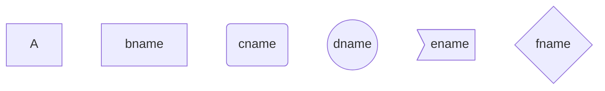

## 1. 图方向

- TB，从上到下
- TD，从上到下
- BT，从下到上
- RL，从右到左
- LR，从左到右

T = TOP，B = BOTTOM，L = LEFT，R = RIGHT，D = DOWN

## 2. 节点形状

- 默认节点 A
- 文本节点 B[bname]
- 圆角节点 C(cname)
- 圆形节点 D((dname))
- 非对称节点 E>ename]
- 菱形节点 F{fname}



## 3. 连线

节点间的连接线有多种形状，可以在连接线中加入标签：

+ 箭头连接 `A1–->B1`
+ 开放连接 `A2—B2`
+ 标签连接 `A3–text—B3`
+ 箭头标签连接 `A4–text–>B4`
+ 虚线开放连接 `A5.-B5`
+ 虚线箭头连接 `A6-.->B6`
+ 标签虚线连接 `A7-.text.-B7`
+ 标签虚线箭头连接 `A8-.text.->B8`
+ 粗线开放连接 `A===B9`
+ 粗线箭头连接 `A10==>B10`
+ 标签粗线开放连接 `A11==text===B11`
+ 标签粗线箭头连接 `A12==text==>B12`


##  4. 流程图

### 4.1 横向流程图


### 4.2 竖向流程图


### 4.3 标准流程图

```flow
st=>start: 开始框
op=>operation: 处理框
cond=>condition: 判断框
sub1=>subroutine: 子流程
io=>inputoutput: 输入输出框
e=>end: 结束框
st->op->cond
cond(yes)->io->e
cond(no)->sub1(right)->op
```

### 4.4 标准流程图(横向)

```flow
st=>start: 开始框
op=>operation: 处理框
cond=>condition: 判断框(是或否?)
sub1=>subroutine: 子流程
io=>inputoutput: 输入输出框
e=>end: 结束框
st(right)->op(right)->cond
cond(yes)->io(bottom)->e
cond(no)->sub1(right)->op
```

## 5. UML时序图

### 5.1 UML时序图

```sequence
对象A->对象B: 对象B你好吗? (请求)
Note right of 对象B: 对象B的描述
Note left of 对象A: 对象A的描述(提示)
对象B --> 对象A: 我很好(响应)
对象A --> 对象B: 你真的好吗?
```

### 5.2 UML时序图复杂样例

```sequence
Title: 标题: 复杂使用
对象A -> 对象B: 对象B你好吗? (请求)
Note right of 对象B: 对象B的描述
Note right of 对象A: 对象A的描述(提示)
对象B --> 对象A: 我很好(响应)
对象B --> 小三: 你好吗?
小三 -> 对象A: 对象B找我了
对象A --> 对象B: 你真的好吗?
Note over 小三, 对象B: 我们是朋友
participant C
Note right of C: 没人陪我玩
```

### 5.3 UML标准时序图样例


## 6. 甘特图样例


## 7. 饼图

饼图用于数据展示与统计，可以方便看出占比

语法：

```
pie
 title 标题
 "key1" : value1
 "cats" : value2
```

示例：

养宠物占比图


## 8. 类图


## 9. 用户旅程图


## 10. 状态图


