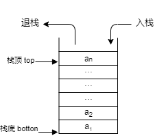

堆栈

特点：后进先出

栈顶：允许插入与删除的一端

栈底：不允许插入与删除的另一端

|         堆栈图          |
| :---------------------: |
|  |

队列

特点：先进先出

队头：允许进行删除运算的一端

队尾：允许进行插入运算的一端

|               队列                |
| :-------------------------------: |
|  |

|        循环队列         |
| :---------------------: |
|  |

循环队列：

+ 即将队列存储空间的的最后一个位置绕到第一个位置，形成逻辑上的环状空间
+ 在循环队列中队头可以大于队尾指针，也可以小于队尾指针

类Comparable接口，方法：`CompareTo()`

Integer类提供`parseInt(String str)`方法，将字符串转为整数类型

Applet不能直接通过Java命令启动运行

运行状态进入阻塞状态：

+ 线程调用了`sleep()`方法、`join()`方法和`wait()`方法时
+ 如果线程中使用`synchronized`来请求对象的锁未获得时
+ 如果线程中有输入/输出操作

java.awt.event 适配类：

+ ComponentAdapter：构件适配器
+ ContainerAdapter：容器适配器
+ FocusAdapter：焦点适配器
+ MouseAdapter：鼠标适配器
+ KeyAdapter：键盘适配器
+ MouseMotionAdapter：鼠标运动适配器
+ WindowAdapter：窗口适配器

new ClassName()：新建一个对象

InputStream类是所有输入流的抽象类

`indexof(string)`方法返回子串string在父类中首次出现的位置，从0开始查找，没有返回 -1

类变量可以直接通过类名调用，需用`static`修饰成静态变量

`while(1){}`：此语句会出错，数字1无法判断是`true`或`false`

JDK 1.7之前，switch语句不支持string类型数据

“++”在前，在赋值前先自身+1；“++”在后，先赋值再自身+1，如a=5,b=5，则a++ + b++ =25，而++a + ++b =36

八进制在数值前加“0”表示；十六进制在数值加“0x”，八进制的范围是 0-7

命名规范：只能由字母、数字、$和下划线组成

方法命名规范：遵循驼峰命名法，即第一个单词首字母小写，后面每个首字母大写

java的特点：多线程、跨平台、动态性、单继承

线性链表结构特点：用一组不连续的存储单元存储线性表中的各个元素

二叉树的性质：对任何一棵二叉树，度为0的节点（即叶子节点）总比度为2的节点多一个

方法重写一般遵循的原则：

+ 重写存在于父类与子类之中
+ 重写方法必须与被重写方法相同的方法名、参数列表、返回类型
+ 重写方法的修饰符访问权限必须大于等于被重写方法修饰符访问权限
+ 重写方法抛出的异常必须小于等于被重写方法抛出的异常

访问权限大小关系：public>protected>default>private；默认方法修饰符：default

如果一个成员变量用static关键字修饰，则这个变量不再属于对象自己，而是属于所在类，多个对象共享同一份数据

String类中的`equals()`方法比较两个字符串内容是否相等

`Math.random()`：随机产生大于等于0.0小于1.0的伪随机

ByteArrayInputStream可从字节数组读取数据；ByteArrayOutputStream可向字节数组（缓存区）写入数据

质数（素数）：一个大于1的自然数，除了1和它自身外，不能被其他自然整数整除的数

根据符号位和数值位的编码方法不同，机器数有（移码？）原码、补码和反码三种表示。整数在计算机存储和运算采用补码

设循环队列的存储空间为Q(1:m)，当front=rear=m时循环队列为空；当front=rear且不等于m时，循环队列可能为空，也可能为满。当为空时，可以插入元素；当满时，插入元素会发生“上溢”错误
