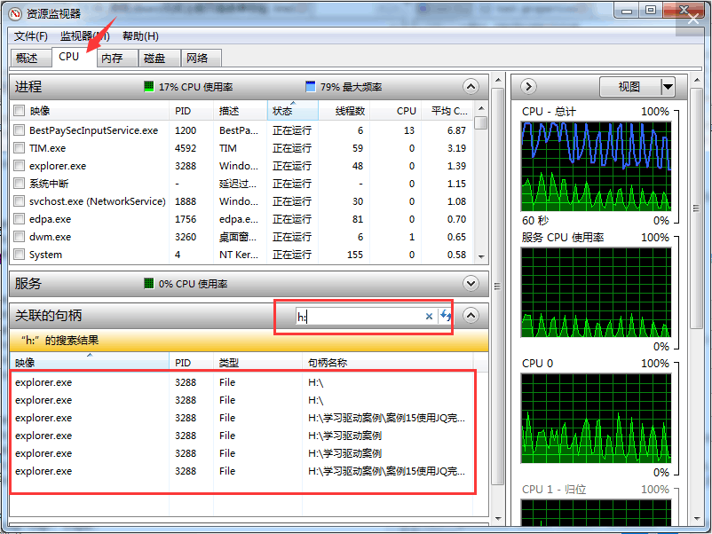

## 清除Windows安全中心病毒和威胁防护的保护历史记录

```
#进入存放记录数据文件夹
C:\Windows\system32> cd C:\ProgramData\Microsoft\Windows Defender\Scans\History\Service\DetectionHistory
#删除此文件夹下所有内容
C:\ProgramData\Microsoft\Windows Defender\Scans\History\Service\DetectionHistory> RD /S /Q Path
```

## 隐藏此电脑默认7个文件夹

```
#隐藏Local Documents(文档)文件夹
C:\Windows\system32> REG ADD "HKEY_LOCAL_MACHINE\SOFTWARE\Microsoft\Windows\CurrentVersion\Explorer\FolderDescriptions\{f42ee2d3-909f-4907-8871-4c22fc0bf756}\PropertyBag" /v ThisPCPolicy /t REG_SZ /d Hide
#隐藏Desktop(桌面)文件夹
C:\Windows\system32> REG ADD "HKEY_LOCAL_MACHINE\SOFTWARE\Microsoft\Windows\CurrentVersion\Explorer\FolderDescriptions\{B4BFCC3A-DB2C-424C-B029-7FE99A87C641}\PropertyBag" /v ThisPCPolicy /t REG_SZ /d Hide
#隐藏Local Downloads(下载)文件夹
C:\Windows\system32> REG ADD "HKEY_LOCAL_MACHINE\SOFTWARE\Microsoft\Windows\CurrentVersion\Explorer\FolderDescriptions\{7d83ee9b-2244-4e70-b1f5-5393042af1e4}\PropertyBag" /v ThisPCPolicy /t REG_SZ /d Hide
#隐藏Local Music(音乐)文件夹
C:\Windows\system32> REG ADD "HKEY_LOCAL_MACHINE\SOFTWARE\Microsoft\Windows\CurrentVersion\Explorer\FolderDescriptions\{a0c69a99-21c8-4671-8703-7934162fcf1d}\PropertyBag" /v ThisPCPolicy /t REG_SZ /d Hide
#隐藏Local Pictures(图片)文件夹
C:\Windows\system32> REG ADD "HKEY_LOCAL_MACHINE\SOFTWARE\Microsoft\Windows\CurrentVersion\Explorer\FolderDescriptions\{0ddd015d-b06c-45d5-8c4c-f59713854639}\PropertyBag" /v ThisPCPolicy /t REG_SZ /d Hide
#隐藏Local Videos(视频)文件夹
C:\Windows\system32> REG ADD "HKEY_LOCAL_MACHINE\SOFTWARE\Microsoft\Windows\CurrentVersion\Explorer\FolderDescriptions\{35286a68-3c57-41a1-bbb1-0eae73d76c95}\PropertyBag" /v ThisPCPolicy /t REG_SZ /d Hide
#隐藏3D Objects(3D 对象)文件夹
C:\Windows\system32> REG ADD "HKEY_LOCAL_MACHINE\SOFTWARE\Microsoft\Windows\CurrentVersion\Explorer\FolderDescriptions\{31C0DD25-9439-4F12-BF41-7FF4EDA38722}\PropertyBag" /v ThisPCPolicy /t REG_SZ /d Hide
#注：值为 Display 显示文件夹
```

## 解除U盘占用

   资源监视器窗口，点击切换到CPU页

   在“关联的句柄”搜索框内输入盘符+冒号（如h:），就可以查看有哪些进程在占用usb设备。把这些进程在任务管理器里结束掉，然后可正常安全地弹出usb设备



## 查看系统信息

`Win + R` 输入`msinfo32`

## 解决U盘被程序占用而无法弹出

右键开始图标——计算机管理——事件查看器——自定义视图——管理事件，查看U盘弹出引起错误事件的对应程序，在任务管理器结束占用程序即可

## BIOS

更改前：


更改后：


## 本机IP查询

```cmd
ipconfig /all
```

## 刷新DNS

```cmd
ipconfig /flushdns
```

## 重置网卡

```cmd
netsh winsoc
```

## 打开图片时出现安全警告

```
增加一个用户环境变量SEE_MASK_NOZONECHECKS，设置值为1.
or
[HKEY_CURRENT_USER\Environment]
"SEE_MASK_NOZONECHECKS"="1"
```

## carbon

网址无法加载或者出现 `x` 字

关闭 "I don't care about cookies" 插件

## 火狐浏览器无法打印

 在兼容性中开启 “以管理员身份运行此程序“

## 隐藏图片

```cmd
copy /b A.jpg + B.zip C.jpg
```

## msi文件无法打开安装

在注册表修改 `计算机\HKEY_CLASSES_ROOT\.msi` 数据类型改为 `Msi.Package `即可

或者手动安装：

```cmd
F:\Store_1>msiexec /package yarn-1.22.5.msi
```

## 其他

+ 一直按 F2 可进入 `Bois`

+ 快捷键调整可在设置中轻松使用里的键盘进行

+ 冰点还原要用冰点还原安装包删除，否则会出问题!

+ win10任务栏图标存放于：
  
  ```
  C:Users (用户文件夹)\用户名\ AppData \ RoamingMicrosoftVInternet ExplorerQuick LaunchUser PinnedTaskBar
  ```

+ 通过按“ Windows键” +“ R”时，输入“ winver”可以找到您正在使用的版本

+ 组策略编辑器： `gpedit.msc`

+ 